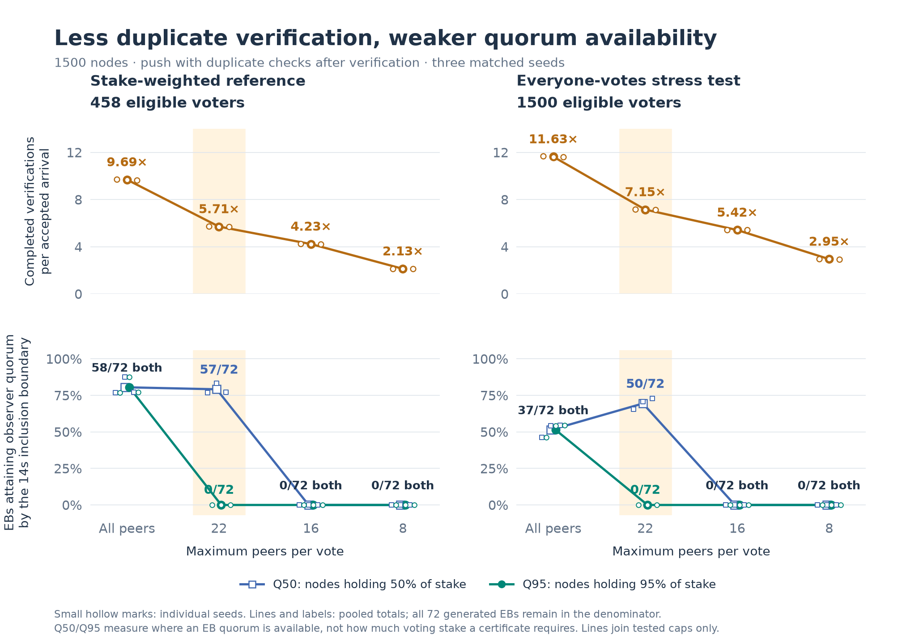
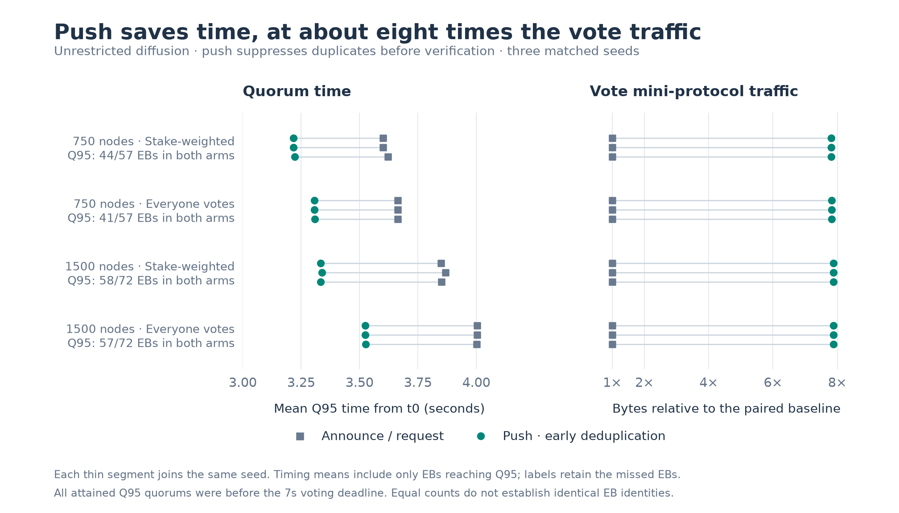
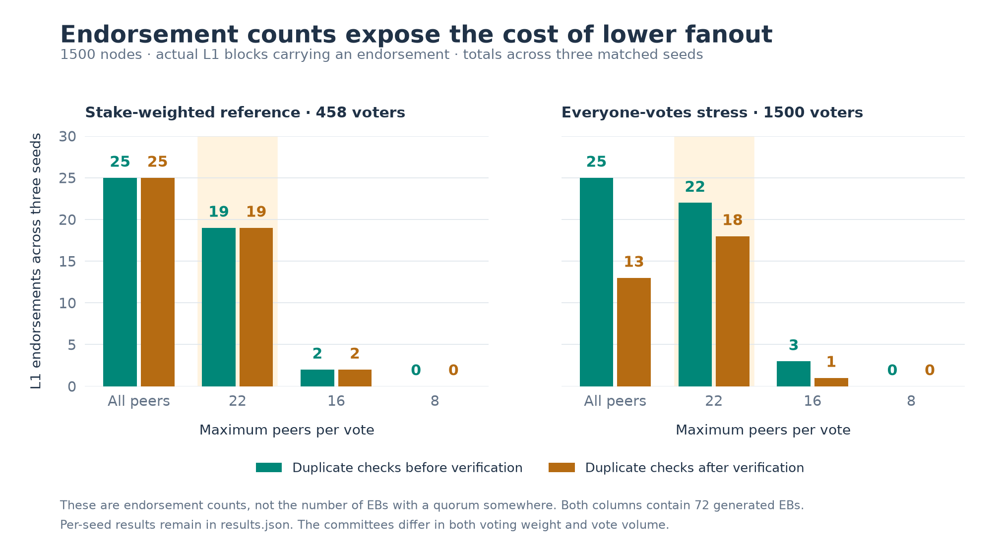

# Corrected Linear Leios vote diffusion results

All **108 runs** completed: two network sizes, two committee modes, three matched seeds, and announce/request plus two push deduplication orders crossed with unlimited/22/16/8 fanout. Simulator revision `0769c07310fba223a09d8082e2744013c6856a43`.

## Findings

- **Unrestricted push trades bandwidth for about half a second.** Across all 12 paired size/committee/seed comparisons, early-deduplicating push retained the announce/request arm's Q95 attainment and L1 endorsement counts. Its conditional mean Q95 time was 0.356–0.530s earlier, with 7.81–7.88× the vote mini-protocol bytes. These are equal counts, not an EB-identity comparison.
- **Stake-weighted voting does not reproduce the everyone-votes certification loss under unlimited late deduplication.** At 1500 nodes, both push orders reached Q95 for 58/72 generated EBs and produced 25 L1 endorsements across the three seeds. Late deduplication still incurred 9.69 completed verifications per accepted arrival and increased conditional mean Q95 times from 3.334–3.339s to 3.796–3.814s. The reference has 458 eligible pools, so it also generates fewer vote bodies than the 1500-voter stress arm.
- **Fanout 22 relieves some verification load, at a cost in availability.** In the 1500-node everyone-votes, late-deduplication arm, it reduced total completed verifications by 30.0% and wire bytes by 29.4%; median-observer quorum attainment increased from 37/72 to 50/72 EBs and L1 endorsements from 13 to 18. Q95 attainment fell from 37/72 to zero. In the stake-weighted late-deduplication arm, fanout 22 cut wire bytes by 40.3% and verifications by 43.2%, but median attainment fell from 58/72 to 57/72 and endorsements from 25 to 19; Q95 again fell to zero.
- **None of the tested bounded fanouts preserves broad quorum availability.** All 72 runs with fanout 22/16/8 had zero EBs reaching Q95. Fanout 22 often retained median-observer quorum, while 16 and 8 never reached the median in these runs. Fanout 8 produced zero L1 endorsements in every arm. A first-node quorum can still exist; zero Q95 does not mean nobody obtained a quorum.

These results support unlimited simple vote streaming as feasible under the modeled load, with a bandwidth/latency trade-off. They do not establish a safe bounded-fanout setting or predict the Haskell node's exact performance. Lower fanout reduces verification work but, in this matrix, does not preserve the broad availability of unrestricted diffusion.

## Reading the measurements

An EB quorum means a node has votes totaling 75% of active stake in the fixed-size reference, or 75% of nodes in the everyone-votes stress arm. **Q50/Q95 are different thresholds:** the time when nodes holding 50%/95% of observer stake each have that EB quorum. They are not 50%/95% of vote bodies received. The summary's separate body-coverage statistic is unweighted by observer stake and is not a certificate-availability guarantee.

Counts include every generated EB; missed quorums remain in the denominator. Timing means include only EBs that reached the stated observer threshold. All reported attained observer quorums in this batch occurred by 7s, so their counts by 7s, by 14s and at run end coincide. This does not make 7s and 14s interchangeable protocol constraints. L1 endorsements count blocks that actually included an endorsement; they are not the same as EBs that reached a quorum somewhere.

## Availability versus verification cost at 1500 nodes



**Figure 1.** Reducing fanout lowers completed verifications per accepted arrival
in both committees (top panels). At fanout 22, Q50 attainment rises only in the
everyone-votes stress arm; Q95 falls to zero in both committees (bottom panels).
The small hollow marks show individual seeds and the labeled lines pool all
three. The shaded column highlights fanout 22. Lines connect tested settings;
they do not establish behavior between those settings.

The table sums each arm's three seeds (72 generated EBs). Observer counts are attainment by 14s; the same counts were attained by 7s. `Verify / accepted` divides total completed verifications by total accepted arrivals.

| Committee | Transport | Fanout | First-node quorum | Q50 | Q95 | L1 endorsements | Verify / accepted |
|---|---|---|---:|---:|---:|---:|---:|
| top-stake-seats | push | all | 58/72 | 58/72 | 58/72 | 25 | 1.00 |
| top-stake-seats | push-late-dedupe | all | 58/72 | 58/72 | 58/72 | 25 | 9.69 |
| top-stake-seats | push-late-dedupe | 22 | 58/72 | 57/72 | 0/72 | 19 | 5.71 |
| top-stake-seats | push-late-dedupe | 16 | 57/72 | 0/72 | 0/72 | 2 | 4.23 |
| everyone | push | all | 57/72 | 57/72 | 57/72 | 25 | 1.00 |
| everyone | push-late-dedupe | all | 37/72 | 37/72 | 37/72 | 13 | 11.63 |
| everyone | push-late-dedupe | 22 | 50/72 | 50/72 | 0/72 | 18 | 7.15 |
| everyone | push-late-dedupe | 16 | 52/72 | 0/72 | 0/72 | 1 | 5.42 |

## Transport comparisons



**Figure 2.** Each segment compares the same seed. Push consistently moves Q95
earlier (left), while sending about eight times the vote mini-protocol bytes
(right). The row labels retain missed EBs: the time advantage is conditional on
attainment, not a claim that every EB met the deadline.

These compare unlimited-fanout push with announce/request for the same topology, committee and seed. Time differences are between conditional per-EB observer means; matching counts do not prove matching EB identities.

| Nodes | Committee | Push / announce traffic | Push − announce Q95 mean (s) | Equal Q95 attainment counts | Equal L1 endorsement counts |
|---:|---|---:|---:|---:|---:|
| 750 | top-stake-seats | 7.81–7.81× | -0.399–-0.382 | 3/3 seeds | 3/3 seeds |
| 750 | everyone | 7.82–7.82× | -0.356–-0.356 | 3/3 seeds | 3/3 seeds |
| 1500 | top-stake-seats | 7.88–7.88× | -0.530–-0.515 | 3/3 seeds | 3/3 seeds |
| 1500 | everyone | 7.88–7.88× | -0.478–-0.476 | 3/3 seeds | 3/3 seeds |

## Endorsements and validation order



**Figure 3.** Under unrestricted push, late deduplication reduces endorsements
from 25 to 13 in the everyone-votes stress arm, while the stake-weighted reference
retains 25 with either order. Fanout 22 raises the stress arm's late-deduplication
count to 18, but reduces the reference to 19. This explains why the local recovery
in the overloaded arm is insufficient to recommend fanout 22: Figure 1 also
shows its loss of Q95 availability. Bars sum three seeds and count actual L1
endorsements, not EBs with a quorum somewhere.

## Fanout and validation order

Each row combines three seeds. Q95 attainment is the sum of per-run EB counts. Timing ranges cover available run means among EBs that attained Q95 quorum; missing EBs remain visible in the attainment columns. Verification amplification is total completed verifications divided by total accepted arrivals. Traffic is the range of per-run decimal GB, rounded in the simulator logs.

| Nodes | Committee | Transport | Fanout | Q95 reached | Q95 by 7s | Q95 by 14s | Q95 mean s range | Wire GB range | Verify / accepted | Pending arrivals |
|---:|---|---|---|---:|---:|---:|---:|---:|---:|---:|
| 750 | top-stake-seats | announce-then-request | all | 44/57 | 44/57 | 44/57 | 3.600–3.621 | 0.655–0.749 | 1.00 | 0 |
| 750 | top-stake-seats | push | all | 44/57 | 44/57 | 44/57 | 3.218–3.222 | 5.116–5.850 | 1.00 | 0 |
| 750 | top-stake-seats | push | 22 | 0/57 | 0/57 | 0/57 | none reached | 3.213–3.651 | 1.00 | 0 |
| 750 | top-stake-seats | push | 16 | 0/57 | 0/57 | 0/57 | none reached | 2.340–2.638 | 1.00 | 0 |
| 750 | top-stake-seats | push | 8 | 0/57 | 0/57 | 0/57 | none reached | 1.173–1.323 | 1.00 | 0 |
| 750 | top-stake-seats | push-late-dedupe | all | 44/57 | 44/57 | 44/57 | 3.323–3.334 | 5.118–5.855 | 6.85 | 0 |
| 750 | top-stake-seats | push-late-dedupe | 22 | 0/57 | 0/57 | 0/57 | none reached | 3.213–3.651 | 3.82 | 0 |
| 750 | top-stake-seats | push-late-dedupe | 16 | 0/57 | 0/57 | 0/57 | none reached | 2.340–2.638 | 2.60 | 0 |
| 750 | top-stake-seats | push-late-dedupe | 8 | 0/57 | 0/57 | 0/57 | none reached | 1.173–1.323 | 1.24 | 0 |
| 750 | everyone | announce-then-request | all | 41/57 | 41/57 | 41/57 | 3.663–3.664 | 2.245–2.547 | 1.00 | 0 |
| 750 | everyone | push | all | 41/57 | 41/57 | 41/57 | 3.307–3.308 | 17.560–19.915 | 1.00 | 0 |
| 750 | everyone | push | 22 | 0/57 | 0/57 | 0/57 | none reached | 11.011–12.487 | 1.00 | 0 |
| 750 | everyone | push | 16 | 0/57 | 0/57 | 0/57 | none reached | 8.026–8.966 | 1.00 | 0 |
| 750 | everyone | push | 8 | 0/57 | 0/57 | 0/57 | none reached | 4.024–4.495 | 1.00 | 0 |
| 750 | everyone | push-late-dedupe | all | 37/57 | 37/57 | 37/57 | 3.864–3.873 | 17.040–19.526 | 10.29 | 0 |
| 750 | everyone | push-late-dedupe | 22 | 0/57 | 0/57 | 0/57 | none reached | 10.955–12.488 | 6.49 | 0 |
| 750 | everyone | push-late-dedupe | 16 | 0/57 | 0/57 | 0/57 | none reached | 7.985–8.918 | 4.86 | 0 |
| 750 | everyone | push-late-dedupe | 8 | 0/57 | 0/57 | 0/57 | none reached | 4.010–4.481 | 2.55 | 0 |
| 1500 | top-stake-seats | announce-then-request | all | 58/72 | 58/72 | 58/72 | 3.849–3.869 | 3.543–4.200 | 1.00 | 0 |
| 1500 | top-stake-seats | push | all | 58/72 | 58/72 | 58/72 | 3.334–3.339 | 27.906–33.086 | 1.00 | 0 |
| 1500 | top-stake-seats | push | 22 | 0/72 | 0/72 | 0/72 | none reached | 16.665–19.525 | 1.00 | 0 |
| 1500 | top-stake-seats | push | 16 | 0/72 | 0/72 | 0/72 | none reached | 12.036–14.223 | 1.00 | 0 |
| 1500 | top-stake-seats | push | 8 | 0/72 | 0/72 | 0/72 | none reached | 6.036–7.133 | 1.00 | 0 |
| 1500 | top-stake-seats | push-late-dedupe | all | 58/72 | 58/72 | 58/72 | 3.796–3.814 | 27.802–32.814 | 9.69 | 0 |
| 1500 | top-stake-seats | push-late-dedupe | 22 | 0/72 | 0/72 | 0/72 | none reached | 16.660–19.516 | 5.71 | 0 |
| 1500 | top-stake-seats | push-late-dedupe | 16 | 0/72 | 0/72 | 0/72 | none reached | 12.036–14.223 | 4.23 | 0 |
| 1500 | top-stake-seats | push-late-dedupe | 8 | 0/72 | 0/72 | 0/72 | none reached | 6.036–7.133 | 2.13 | 0 |
| 1500 | everyone | announce-then-request | all | 57/72 | 57/72 | 57/72 | 4.002–4.003 | 11.480–13.612 | 1.00 | 0 |
| 1500 | everyone | push | all | 57/72 | 57/72 | 57/72 | 3.525–3.526 | 90.488–107.295 | 1.00 | 0 |
| 1500 | everyone | push | 22 | 0/72 | 0/72 | 0/72 | none reached | 53.997–63.528 | 1.00 | 0 |
| 1500 | everyone | push | 16 | 0/72 | 0/72 | 0/72 | none reached | 39.020–46.146 | 1.00 | 0 |
| 1500 | everyone | push | 8 | 0/72 | 0/72 | 0/72 | none reached | 19.568–23.116 | 1.00 | 0 |
| 1500 | everyone | push-late-dedupe | all | 37/72 | 37/72 | 37/72 | 5.076–5.147 | 74.410–79.140 | 11.63 | 0 |
| 1500 | everyone | push-late-dedupe | 22 | 0/72 | 0/72 | 0/72 | none reached | 50.608–55.802 | 7.15 | 0 |
| 1500 | everyone | push-late-dedupe | 16 | 0/72 | 0/72 | 0/72 | none reached | 37.048–42.742 | 5.42 | 0 |
| 1500 | everyone | push-late-dedupe | 8 | 0/72 | 0/72 | 0/72 | none reached | 19.534–23.073 | 2.95 | 0 |

## Scope and interpretation

- The fixed-size mode is stake-weighted with quorum against total active stake. Its 900-seat request seats all 216 available pools at 750 nodes and all 458 at 1500 nodes. The everyone mode supplies the larger vote-volume stress test but uses node-count quorum. These modes differ in both voting weight and vote volume.
- A fanout result applies to the tested topology, seed and validation order. The tables supersede the previous general recommendation that 22 is usable and lower limits are unusable; the observer threshold and actual endorsement counts matter. Three seeds do not establish a universal safe limit.
- Quorum by 7s is an early-attainment metric. Voting closes at 7s; vote diffusion has an additional allowance until the 14s inclusion boundary.
- The fixed 400-slot horizon can leave the newest EBs unfinished. Means are conditional on attaining quorum. Equal counts do not establish equal EB identities, and these summary-only runs do not contain per-EB traces.
- Shared header approximations can affect differences between arms through CPU queueing, header eligibility and subsequent votes. Missing per-peer serialization, notification credits and shared queues limit quantitative transfer to Haskell. Full node parity remains outside this voting-strategy study.

## Provenance and reproduction

Upstream config: `ouroboros-leios` `f307ed5fa7077a32eb470ca3832a34092882bfe3`. Binary SHA-256: `cafe6ca9f9f4b36432a9682cbb23f001b3dac93f8679867e887e5201282ba873`. Offered load: 6 ms interarrival (~167 tx/s), 1500-byte transactions starting at 60s. Each simulation ran 400 slots with echo disabled, four cores per node and 10 Mb/s links. Runs executed sequentially using a frozen executable and checksum-verified inputs.

The [study guide](../vote-diffusion-study.md) documents the matrix. [results.json](results.json) contains all per-run metrics and matched comparisons; [runs.csv](runs.csv) records completed runs. Reproducibility artifacts:

- [inputs.tar.gz](inputs.tar.gz): all 113 original input files (including both topologies and all 108 per-run overlays), plus the empty tracked-source patch. [input-sha256.json](input-sha256.json) checks the original bytes inside this archive. Extract this archive to inspect the exact configurations used.
- [summary-logs.tar.gz](summary-logs.tar.gz): the 108 original summary logs, checked by [log-sha256.json](log-sha256.json). These are summaries, not per-event traces.
- [extract-results.py](extract-results.py): the summary parser, without runner controls or publication side effects. It can regenerate the results from these artifacts. No additional simulation is needed for this check.
- [binary.sha256](binary.sha256) and [revision.txt](revision.txt): the original executable hash and source revision. The executable remains local. Rebuilding on another platform need not reproduce its binary hash.

To verify and re-extract in a new directory, from this report directory:

```sh
mkdir /tmp/leios-results-check
tar -xzf inputs.tar.gz -C /tmp/leios-results-check
tar -xzf summary-logs.tar.gz -C /tmp/leios-results-check
cp runs.csv revision.txt upstream-revision.txt binary.sha256 /tmp/leios-results-check/
python3 extract-results.py /tmp/leios-results-check
```

Raw simulator runs used the frozen executable at revision `0769c073` with no tracked source diff. Inputs and executable checksums were verified before execution and again after the batch. All 108 logs have final protocol/network summaries, no logged error/panic, consistent acceptance accounting and consistent quorum/deadline counts. Parsed results were independently regenerated from the published archives. `passed` means the simulation completed successfully, not that every EB reached quorum.

### Regenerating the figures

[plot-results.py](plot-results.py) reads only the committed `results.json` and
writes the three PNGs in `figures/`. It uses per-seed paired comparisons, summed
counts, and `sum(verifications) / sum(accepted)` for pooled verification cost;
no plotted measurements are entered manually. The figures were rendered with
Python 3.13 and Matplotlib 3.11.2:

```sh
python3 -m venv /tmp/leios-figure-env
/tmp/leios-figure-env/bin/pip install matplotlib==3.11.2
/tmp/leios-figure-env/bin/python plot-results.py
```

The source revision above remains the provenance of the 108 experiments. The
subsequent PR scope cleanup removes an unused transport mode and limits complete
vote-traffic reporting to Linear; it does not change the three studied Linear
transport modes, their inputs, or these archived results.
The cleanup passes 155 Rust tests (one ignored). Twenty paired 8-node, 40-slot
release runs against the frozen study binary produced identical complete
protocol and network summaries. They covered both committees, two seeds, all
three transports, and both push orders with unlimited and bounded fanout, using
uneven stake and 100 ms verification to exercise concurrent duplicates.
